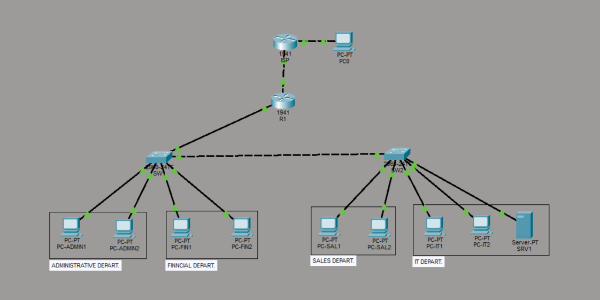

# corporate-network-project-techstore-pro
Corporate network simulation with VLANs, NAT, ACLs and DNAT
# Corporate Network Project – TechStore Pro

## Overview

This project simulates a corporate network infrastructure using Cisco Packet Tracer.
It was designed to replicate a real-world enterprise environment, focusing on network segmentation, security, and controlled communication between departments.

The implementation includes core networking concepts such as VLANs, inter-VLAN routing, DHCP, NAT, ACLs, and DNAT.

---

## Network Scenario

The company **TechStore Pro** consists of four departments:

* Administrative
* Financial
* Sales
* IT

Each department operates within its own VLAN to ensure security and proper network organization.

---

## Key Features

* 🔹 VLAN segmentation for network isolation
* 🔹 Inter-VLAN routing (Router-on-a-Stick)
* 🔹 DHCP for automatic IP address assignment
* 🔹 ACLs for traffic control and security
* 🔹 NAT (PAT) for internet access
* 🔹 DNAT (Port Forwarding) for external access to internal services
* 🔹 Troubleshooting and validation using CLI commands

---

## IP Addressing Plan

| VLAN | Department     | Network         | Gateway      |
| ---- | -------------- | --------------- | ------------ |
| 10   | Administrative | 192.168.10.0/24 | 192.168.10.1 |
| 20   | Financial      | 192.168.20.0/24 | 192.168.20.1 |
| 30   | IT             | 192.168.30.0/24 | 192.168.30.1 |
| 40   | Sales          | 192.168.40.0/24 | 192.168.40.1 |

---

## Security Policies

* VLAN-based network isolation
* Restricted access between Sales and Financial departments
* Centralized server located in the IT VLAN
* Traffic filtering implemented using ACLs

---

## Verification & Troubleshooting

The following commands were used to validate and troubleshoot the network:

* `show ip route` → Verify routing table
* `show vlan brief` → Confirm VLAN configuration
* `show interfaces trunk` → Validate trunk links
* `show ip nat translations` → Check NAT operation
* `show access-lists` → Verify ACL rules
* `show ip interface brief` → Confirm interface status

---

## Network Topology



---

## 🛠️ Technologies Used

* Cisco Packet Tracer
* Networking (TCP/IP, VLANs, Routing, NAT, ACL)

---

## Project Structure

```
corporate-network-project-techstore-pro/
│
├── README.md
├── docs/
│   └── Corporate Network Project – TechStore Pro.pdf
│
├── project/
│   └── Corporate Network Project – TechStore Pro.pkt
│
└── images/
    └── topology.png
```

---

## Key Learning Outcomes

* Practical implementation of enterprise network design
* Hands-on experience with VLANs and routing
* Understanding of NAT and port forwarding (DNAT)
* Network troubleshooting and validation using CLI
* Real-world simulation of corporate network environments

---

## Author

**Vitor Andrade**

---

## Notes

This project was developed as part of a networking portfolio to demonstrate practical skills in network configuration, security, and troubleshooting.
